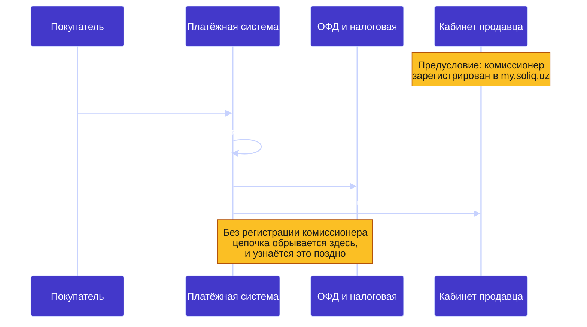
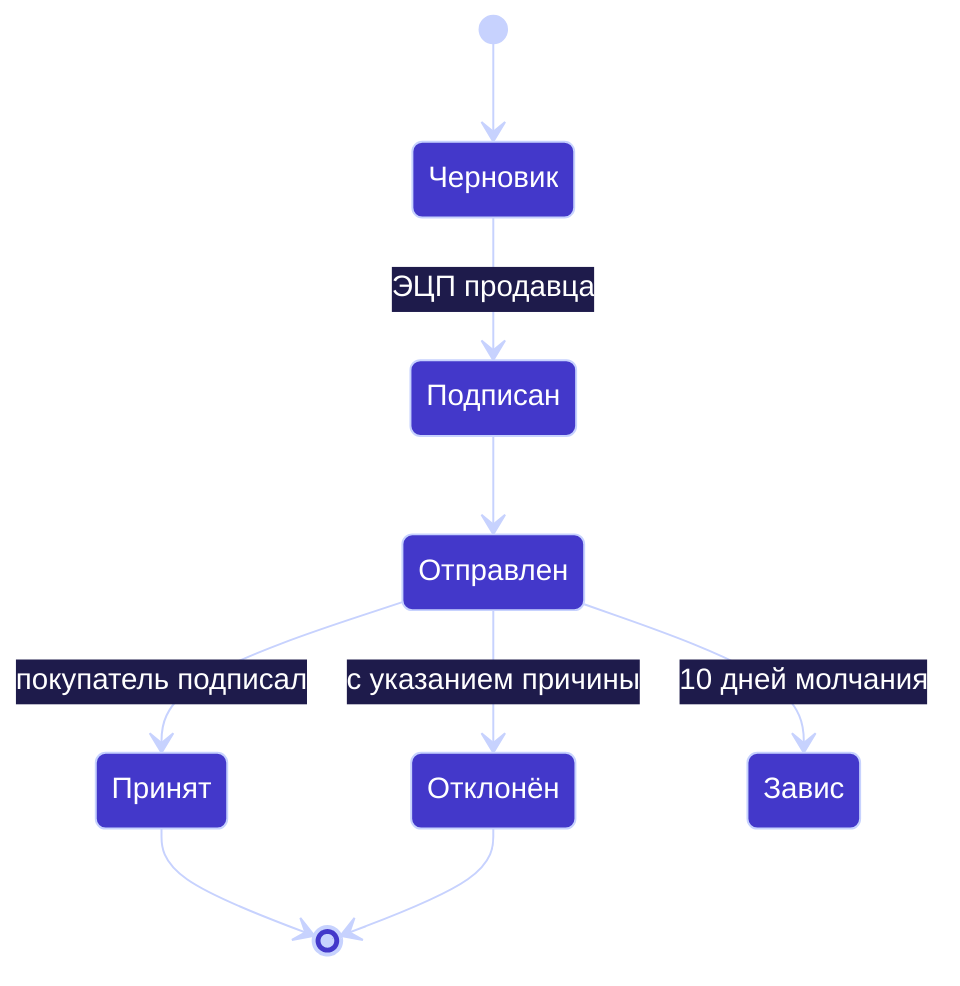

# 🧾 Фискальный контур Узбекистана

**ИКПУ · онлайн-касса · ЭСФ · Asl Belgisi** — глазами разработчика

---

## 🎯 Зачем разработчику вообще в это лезть

Почти вся эта механика ломается не в государственных сервисах, а **на стыке с
учётной системой клиента**. Касса требует код товара — а присваивает его человек в
1С, в складской программе или в таблице. Платёжная система фискализирует чек — но
только если продавец её зарегистрировал.

Отдельно: локальные API здесь плохо представлены в открытых источниках, а
документация часто приходит PDF-файлом от менеджера провайдера. Языковые модели по
этим темам уверенно выдают правдоподобный неверный код — проверено на практике.
Это одна из причин, по которой работа остаётся человеческой.

---

## 🏷️ ИКПУ: у каждой позиции есть код

ИКПУ — идентификационный код товаров и услуг. Аналогия: ИНН, только не для
компании, а для каждой позиции прайса. Все коды лежат в государственном каталоге
`tasnif.soliq.uz`.

Касса отправляет в чеке **код**, а не название из вашей номенклатуры.

### Как это проектировать

- **Код присваивает человек, а не автоподбор.** Автоматический подбор по названию
  ошибается, а неверный код — налоговый риск для клиента. Интерфейс предлагает
  варианты, решение фиксирует человек, система хранит кто и когда присвоил.
- **Справочник кэшируется локально.** Дёргать каталог на каждый показ товара
  нельзя; храните копию позиции с датой обновления.
- **Товар нельзя завести без кода и единицы измерения по классификатору.**
  Запрет на уровне сценария, а не подсказка в интерфейсе.
- **Нужен отчёт «позиции без ИКПУ».** Иначе пробел обнаружится при проверке.

Частая ошибка: код подбирают «похожий, сойдёт». Потом оказывается, что заведение
общепита пробивает чеки с кодами стройматериалов.

---

## 🖨️ Онлайн-касса: требования расширились с 1 апреля 2026

Касса перестала быть печатающим устройством и стала участником операции — она
может **отказать** в продаже.

Четыре функции, которые она обязана поддерживать:

1. ограничение наличных платежей по отдельным категориям — алкоголь, табак,
   топливо, госуслуги, товары дороже 25 млн сум;
2. продажа рецептурных лекарств только после сканирования QR-кода рецепта;
3. запрет на формирование чека для товара с истёкшим сроком годности;
4. корректная обработка расчётов социальными картами с передачей данных транзакции.

Ответственность за то, что касса это умеет, лежит на предпринимателе, а не на
производителе оборудования.

**Следствие для системы учёта:** сроки годности перестали быть справочным полем.
Если они неактуальны, касса начнёт отказывать в продаже в самый неподходящий момент.

---

## 💳 Фискализация онлайн-оплат: место, где чеки молча не уходят

Самое частое заблуждение: «я принимаю оплату в Telegram-боте через платёжную
систему, касса ко мне не относится». Относится — онлайн-оплата такая же продажа.

Покупать физическую кассу при этом не нужно: платёжная система фискализирует чек
за вас, выступая **комиссионером**. Но работает это только после регистрации.

Что должен сделать продавец:

- зарегистрировать платёжную систему комиссионером в личном кабинете
  `my.soliq.uz` — номер договора, дата заключения и срок действия;
- проверять свои чеки в разделе «Чеки комиссионеров»;
- следить, что позиции имеют ИКПУ — в чек уходит код, а не название из бота.

Альтернатива — фискализировать самостоятельно, тогда нужна онлайн-касса или
лицензия на виртуальную кассу, которую продаёт только аккредитованный ЦОТУ, он же
регистрирует кассу у оператора фискальных данных.

---

## 📄 ЭСФ: счёт-фактура, которая может зависнуть

Счета-фактуры оформляются только в электронном виде. «Электронный» здесь не значит
«PDF по почте» — это документ в государственной системе, который вторая сторона
подписывает своей ЭЦП.

Ключевые моменты для проектирования:

- **10 календарных дней** у покупателя на подписание или отклонение с причиной.
  Календарных, а не рабочих: праздники и отпуска внутри срока.
- **Идемпотентность по документу.** Повторная отправка не должна создавать второй
  ЭСФ на ту же реализацию — двойная фактура это налоговая проблема, а не баг
  интерфейса.
- **ИНН — ключ сопоставления контрагента**, не название.
- **Нужен отчёт «реализации без ЭСФ» и «ЭСФ без подписи».** Без него про
  зависшие документы вспоминают в отчётный период.
- **С 1 января 2026** при продаже товаров по лицензируемым видам деятельности ЭСФ
  оформляется только после автоматической проверки лицензии. Срок действия
  лицензии стал операционным параметром, а не бумагой в папке.
- **Подпись ЭЦП — главный архитектурный вопрос.** Ключ клиента не должен храниться
  в вашей системе в открытом виде; способ подписания выбирается до написания кода.

Между операторами ЭДО действует роуминг, поэтому контрагент может работать у
другого оператора. Значит контракт в домене один, а адаптеров может быть несколько.

---

## 🔬 Маркировка Asl Belgisi

Национальная система прослеживаемости, оператор — ООО «CRPT TURON». На упаковку
наносится код Data Matrix.

Принципиальное отличие от штрихкода:

| | Штрихкод | Код маркировки |
|---|---|---|
| Уникальность | один на всю партию | **уникален у каждой единицы** |
| Отвечает на вопрос | «что это за товар» | «какая именно это единица» |

Магазин обязан фиксировать операции с маркированным товаром — и приёмку, и выбытие
при продаже. Отсюда типичная жалоба «касса не даёт продать»: если приёмка не
отражена, для системы товара у магазина нет.

Перечень маркируемых товаров **постоянно расширяется** — это значит, что разово
разобраться и забыть не получится, и каждое расширение списка это новая дата, к
которой нужно быть готовым.

---

## 🏗️ Что из этого следует для архитектуры

1. **Контракт в домене, адаптер в инфраструктуре.** Операторов ЭДО несколько,
   платёжных провайдеров трое, кассовых решений много. Меняется адаптер, а не
   бизнес-логика.
2. **Идемпотентность везде, где есть внешняя система.** Двойной платёж, двойной
   ЭСФ и двойная выгрузка каталога одинаково недопустимы.
3. **Журнал интеграции обязателен.** Направление, провайдер, запрос, ответ, код,
   время. Без него разбор инцидента на проде невозможен.
4. **Песочница отделена от продакшена на уровне конфигурации**, с явным
   индикатором режима: случайно отправленный в налоговую тестовый документ —
   отдельный жанр проблем.
5. **Ничего не берите из вторичных источников.** Суммы штрафов и состав требований
   проверяйте по первоисточнику. Цифра, гуляющая по блогам, вполне может не
   подтверждаться ни одним официальным документом — проверено.

---

## 🔗 Смежные заметки

- [payment-integration-notes](https://github.com/Shohruh1997/payment-integration-notes) — Payme, Click, Uzum
- [inventory-accounting-notes](https://github.com/Shohruh1997/inventory-accounting-notes) — где в учёте живут ИКПУ и маркировка
- [db-schema-notes](https://github.com/Shohruh1997/db-schema-notes) — схемы БД
- Разборы этих тем для владельцев бизнеса — в блоге [ecomdev.uz](https://ecomdev.uz/ru/blog/)

---

**Шохрух Рузиев** · backend-разработчик, Ташкент

Исходный код систем — в приватных репозиториях, доступ по запросу.

